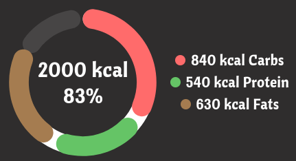
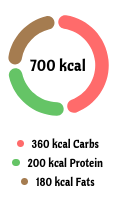

# Custom components

## MacroDonutChart Component

The MacroDonutChart component takes an array of meals and computes the percentage of calories by each macronutrient, the calories. Finally, it shows them in a donut chart fashion.

The color of the text is inherited. Colors for the macros are taken from the `COLORS` object.

### Props:

- `meals` (required): An array of MealData objects, each containing macro and calorie information for a meal.
- `height` (optional): The height of the chart in pixels. Defaults to 200.
- `legendposition`(optional): The position of the legend; can be `side` or `bottom`. Defaults to `side`.
- `targetCalories` (optional): The target daily calorie intake. If provided, the outer ring will display the consumed calories against this target. In this projects's scope, it's supposed to be taken from the current `Profile`.
