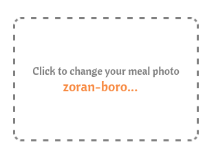

# Chompibara documentation

[TOC]


## What is Chompibara

Chompibara is a food tracking application built with  React, designed to help users monitor their nutrition by uploading  photos of their meals and manually adding nutritional information. It  offers a daily food diary, with visual charts to track calorie and macro consumption.

Chompibara is an educational project, created for learning purposes, as part of a university React course.

This project is licensed under the AGPL Affero Gnu Public License 3.0, and its source code is available [here](https://github.com/fabfabretti/chompibara).

### Key features

* **Meal Tracking**: Users can add, update, and delete meals, including details like calories, macronutrients, and meal type. They can also add an image to visually represent their meal, and categorize them by their tipe (e.g. lunch, dinner)

* **Exercise Tracking**: Users can log basic exercises data, including details like calories burned, duration, and exercise type.

* **Profile Management**: Users can update their profile information, including height, weight, age, and target macros/calories. 

* **History and Stats**: Users can view their recorder meal for each day, and have an aesthetically pleasing dashboard informing them of their macronutrient and calories intake throughout the day, There is also a different page to get similar information throughout a personalized time period, to visualize longer trernds and improvements.

## 2. Installation

### 1. Supabase setup and schema

As this project uses [Supabase](https://supabase.com/) as its backend/database, it is necessary first of all to setup a Supabase project if the original one has not been passed down by the author. At the moment of writing, the original database has not been setup for public or extended use, as this is would be beyond the scope of the project; row-level security policies will need to be set up in order to expand the project further.

The project makes use of the following tables:

|              |                                                              |
| ------------ | ------------------------------------------------------------ |
| `ExerciseDB` |  |
| `MealDataDB` |  |
| `ProfileDB`  |  |

Notes:

* Currently, Chompibara only supports and uses a single user. However, a database table has been set up to allow multi-user development in the future.
* The white dot on the settings cog indicates that the value is nullable.

Furthermore, the images uploaded by the user are saved onto a Storage bucket called `meal-images` , and the database's  `image` column contains a link to the image inside the storage.

It is possible to auto-fill with syntetic a week worth's of data with the follwing SQL query inside the SQL editor in Supabase. Please keep in mind that the URL for the images will need to be filled with a real url.

```SQL
INSERT INTO public."MealDataDB" (photo, title, date, time, mealtype, calories, carbos, protein, fats)
VALUES
  -- Giorno 1
  (<IMAGE URL>, 'Pancakes con sciroppo d acero', CURRENT_DATE, '08:00:00', 'Breakfast', 400, 50, 10, 12),
  (<IMAGE URL>, 'Insalata di pollo e avocado', CURRENT_DATE, '13:00:00', 'Lunch', 750, 40, 45, 30),
  (<IMAGE URL>, 'Salmone al forno con verdure', CURRENT_DATE, '19:30:00', 'Dinner', 650, 35, 50, 25),
  (<IMAGE URL>, 'Mandorle e yogurt greco', CURRENT_DATE, '16:00:00', 'Snack', 200, 10, 15, 10),
  
  -- Giorno 2
  (<IMAGE URL>, 'Uova strapazzate con toast integrale', CURRENT_DATE + 1, '08:00:00', 'Breakfast', 450, 35, 20, 15),
  (<IMAGE URL>, 'Pasta al pesto con pollo', CURRENT_DATE + 1, '13:00:00', 'Lunch', 800, 65, 45, 35),
  (<IMAGE URL>, 'Zuppa di lenticchie e pane di segale', CURRENT_DATE + 1, '19:30:00', 'Dinner', 550, 50, 30, 12),
  (<IMAGE URL>, 'Frutta secca e cioccolato fondente', CURRENT_DATE + 1, '16:00:00', 'Snack', 250, 15, 12, 18),
  
  -- Giorno 3
  (<IMAGE URL>, 'Smoothie alla banana e avena', CURRENT_DATE + 2, '08:00:00', 'Breakfast', 350, 50, 12, 8),
  (<IMAGE URL>, 'Quinoa con ceci e verdure', CURRENT_DATE + 2, '13:00:00', 'Lunch', 700, 75, 30, 20),
  (<IMAGE URL>, 'Bistecca con insalata mista', CURRENT_DATE + 2, '19:30:00', 'Dinner', 750, 25, 60, 35),
  (<IMAGE URL>, 'Barretta proteica', CURRENT_DATE + 2, '16:00:00', 'Snack', 200, 25, 15, 5),
  
  -- Giorno 4
  (<IMAGE URL>, 'Yogurt con granola e frutti di bosco', CURRENT_DATE + 3, '08:00:00', 'Breakfast', 320, 40, 15, 10),
  (<IMAGE URL>, 'Burger di tacchino con patate dolci', CURRENT_DATE + 3, '13:00:00', 'Lunch', 750, 60, 50, 25),
  (<IMAGE URL>, 'Orata al forno con riso', CURRENT_DATE + 3, '19:30:00', 'Dinner', 650, 55, 45, 18),
  (<IMAGE URL>, 'Mela con burro di arachidi', CURRENT_DATE + 3, '16:00:00', 'Snack', 280, 30, 10, 15),
  
  -- Giorno 5
  (<IMAGE URL>, 'Toast con avocado e uovo', CURRENT_DATE + 4, '08:00:00', 'Breakfast', 450, 40, 18, 15),
  (<IMAGE URL>, 'Couscous con verdure e feta', CURRENT_DATE + 4, '13:00:00', 'Lunch', 700, 75, 25, 22),
  (<IMAGE URL>, 'Spezzatino di manzo con purè', CURRENT_DATE + 4, '19:30:00', 'Dinner', 750, 45, 55, 30),
  (<IMAGE URL>, 'Crackers di riso con formaggio', CURRENT_DATE + 4, '16:00:00', 'Snack', 200, 20, 10, 8),
  
  -- Giorno 6
  (<IMAGE URL>, 'Porridge con frutta e miele', CURRENT_DATE + 5, '08:00:00', 'Breakfast', 380, 55, 12, 8),
  (<IMAGE URL>, 'Riso con verdure e tofu', CURRENT_DATE + 5, '13:00:00', 'Lunch', 700, 75, 30, 18),
  (<IMAGE URL>, 'Pollo arrosto con patate', CURRENT_DATE + 5, '19:30:00', 'Dinner', 700, 50, 50, 25),
  (<IMAGE URL>, 'Crackers integrali con hummus', CURRENT_DATE + 5, '16:00:00', 'Snack', 220, 30, 10, 8);

```

You will also need to retrieve your Supabase instance URL and anon key for the next steps.

### 2. Run Chompibara

To run the app locally, follow these steps:

1. Clone the repository

```bash
git clone https://github.com/your-username/chompibara.git
cd chompibara
```

2. Install dependencies

Make sure you have Node.js and npm installed; the project was developed on Node.js version `20.18.1`. Then, run:

```bash
npm install
```

3. Environment Setup

Create an .env file in the root of the project and include your Supabase credentials:

```bash
REACT_APP_SUPABASE_URL=your_supabase_url
REACT_APP_SUPABASE_ANON_KEY=your_supabase_anon_key
```

Please note that, in its current version, the project does not handle RLS policies. Hence, the Supabase database must have them disabled or all queries will return 0 rows.

4. Start the app

Once everything is set up, you can start the development server:

```bash
npm start dev
```

This will start the app on http://localhost:5173 by default.

The same instructions are available on the project's README file.

## Project structure

The project has been initialized using Vite+TS's default configuration.

Additional installed packets are:

* **Font Awesome**: For icons throughout the app.
* **Recharts**: A simple yet effective library for creating smooth, interactive, and visually appealing custom charts.
* **ReactRouter**: A very common library to handle routing.

The folder structure is as follows:

```
src/ 
├── assets/ //contains alla assets used throughout the project, such as the loading animation and the logos. The only exception `chompiabara.png`, which as been moved to `/public` in order to be used as a favicon.
├── components/ //contains all the custom component reused throughout the project.
├── context/ // contains utility data for the application
│   ├── types/ // contains data structure for meals, profiles and exercises.
│   ├── macroColors.tsx //contains the palette chosen for macronutrients
│   └── supabaseManager.tsx // contains a utility object that wraps Supabase's official library to simplify database interactions
└── pages/ // contains the main component for each navigable route.
```

## Pages

Using React Router, these are the main components for each page.

|                          Screenshot                          | Page file and details                                        |
| :----------------------------------------------------------: | ------------------------------------------------------------ |
|  | `/pages/track/Track.tsx` -> This page lets the user upload an image and enter the details for the meal. Client-side input validation is performed. After the meal is added, the user is shown a card with their newly-added meal, and is able to edit or delete it directly. |
|  | `/pages/exercise/Exercise.tsx` -> This page lets the user enter details for their pysical activity. Client-side input validation is performed. After the exercise is added, the user is shown a card with their newly-added exercise, and is able to edit or delete it directly. |
|  | `/pages/history/History.tsx `-> The History page allows users to view their meal and exercise history for a specific day. This page is divided into two panes:<br/>- A dash panel, that shows graphs for the currently viewed day such as daily macronutrient and calories intake graphs.<br />- A history panel, which lets the user choose a day and see the meals and exercises. Each meal/exercise card also lets the user edit or delete the card. Client-side input validation for editing is performed. |
|  | `/pages/stats/Stats.tsx` -> This page lets the user select a custom range of time and see stats such as macronutrient and calories intake graphs throughout multiple days. |
|  | `/pages/profile/Profile.tsx`-> This page lets the user see and edit their profile, including setting a daily calories value that is displayed in Stats and History pages. Client-side input validation is performed. |
|  | `/pages/homepage/Homepage.tsx ` -> This page serves as a simple welcome page for the user, briefly explaining what the application is about. |

## Types

This folder contains type definition and default/placeholder objects for Exercise, Profile and Meal data.

Data structure is the same as the corresponding database tables, and a single datatype is used as the server data structure is under the developer's total control - as opposed to using a third-party-controlled service.

```ts
export type ExerciseData = {
  id: number;
  name: string;
  date: string;
  time: string;
  duration?: string;
  calories?: number;
  type: string;
};
```

```ts
export type MealData = {
  id: number;
  photo?: string;
  title: string;
  date: string;
  time: string;
  mealtype: string;
  calories?: number;
  carbos?: number;
  fats?: number;
  protein?: number;
};
```

```ts
export type ProfileData = {
  height: number;
  age: number;
  id: number;
  name: string;
  surname: string;
  targetcarbo: number;
  targetfat: number;
  targetprotein: number;
  weight: number;
  targetcalories: number;
};
```

## SupabaseManager

SupabaseManager is a singleton object that wraps Supabase's database object to simplify interaction with the database.

Should table names or storage name be edited in database, the variables

```ts
const mealDB = "MealDataDB";
const mealImgStorage = "meal-images";
const exerciseDB = "ExerciseDB";
const profileDB = "ProfileDB";
```

placed at the top of the file must be updated.

Each interaction with the database can be performed by getting the singleton with the code

```ts
  const supabaseManager = SupabaseManager.getInstance();
```

and then each function can be called from the singleton object returned. Each of the available functions has a basic handling of server-side errors, which will display an alert to the user with some information about what's going on.

All API methods are `async` and will return a `Promise`.

This is the available API:

| Name                      | Description                                                  | Parameters                                                   | Return                                                       |
| ------------------------- | ------------------------------------------------------------ | ------------------------------------------------------------ | ------------------------------------------------------------ |
| `createMeal`              | Adds a new meal in the database. Image uploading is handled internally and automatically. | `meal:MealData`<br />`file:File` (optional, contains the image to be uploaded) | `Promise<MealData | null>`, with the added meal.             |
| `getAllMeals`             | Returns an array with every meal in the database.            | None                                                         | `Promise <MealData[] | []>`                                  |
| `getAllDailyMeals`        | Returns an array with every meal recorded for a certain day. | `date:Date`                                                  | `Promise <MealData[] | []>`                                  |
| `getMealsInDateRange`     | Returns an array with every meal recorded in the time period passed as parameter. | `dateStart:Date`<br/>`dateEnd:Date`                          | `Promise <MealData[] |[]>`                                   |
| `updateMeal`              | Updates a meal in the database.                              | `meal:MealData`                                              | `Promise<boolean>`, where `false` indicates the Meal has not been edited correctly. |
| `deleteMeal`              | Deletes the meal from the database.                          | `id:number`                                                  | `Promise<boolean>`, where `false` indicates the Meal has not been deleted correctly. |
| `getProfile`              | Returns the (single, at the moment) Profile in the database. | None                                                         | `ProfileData` if successful, `defaultProfile` otherwise.     |
| `setProfile`              | Edits the (single, at the moment) Profile in the database.   | `profile:ProfileData`                                        | `Promise<boolean>`, where `false` indicates the Profile has not been edited correctly. |
| `createExercise`          | Adds a new exercise to the database.                         | `exercise:ExerciseData`                                      | `Promise<number |null>`, where the number is the `id` of the created meal assigned by Supabase. |
| `updateExercise`          | Updates an exercise in the database.                         | `exercise:ExerciseData`                                      | `Promise<boolean>`, where `false` indicates the Exercise has not been edited correctly. |
| `deleteExercise`          | Deletes an exercise from the database.                       | `id:number`                                                  | `Promise<boolean>`, where `false` indicates the Exercise has not been deleted correctly. |
| `getAllDailyExercises`    | Given a Date, returns all exercises recorded to that day.    | `date:Date`                                                  | `Promise <ExerciseData[] | [] >`                             |
| `getExercisesInDateRange` | Given two Dates, returns all exercises recorded in that time period | `dateStart:Date`<br/>`dateEnd:Date`                          | `Promise<ExerciseData[] | [] >`                              |

## Custom components

As an additional exercise to learn React, the original developer has chosen not to use any UI  library and develop all components by hands. This is a list of the available components and their use.

### Chip

#### Usage

A simple chip that's animated on hover, and displays a lable and an icon from Font Awesome.

It takes as prompts:

* `icon`: a JSX element, which must be an icon from Font Awesome.
* `label`: the label to be displayed besides the icon
* `color` (optional):  the color of the label. 

#### Dependencies

The component uses Font Awesome's icons.

It's used by [MealCard](###MealCard and ExerciseCard) and  [ExerciseCard](###MealCard and ExerciseCard).

#### Pictures


### DailyStats

### Usage

DailyStat is mostly a "bridge" component, not meant to be reused but more to avoid an overly long History component. It sets up various other components in a nice layout.

#### Dependencies

DailyStat uses [MacroDonutChart](###MacroDonutChart), [MacroProgressRing](###MacroProgressRing), [MacroStackedChart](###MacroStackedChart). 

It's only used in the History page.

#### Pictures


### MealCard and ExerciseCard

#### Usage

Both components are cards that represent an exercise/meal, and offer the user a button to edit and delete it. The edit function has client-side input validation.

They only take a `meal:MealData`/`exercise:ExerciseData` as input, so they are able to display an element and edit in the database, but not to edit its state.

#### Dependencies

When the user enters edit mode, all data gets switches to the corresponding input components: [InputItem](###InputItem), [FileLoader](###FileLoader)  or [MealTypeSelector](MealTypeSelector and ExerciseTypeSelector)/[ExerciseTypeSelector](MealTypeSelector and ExerciseTypeSelector).

The MealCard uses [Chip](###Chip) and a [MacroDonutChart](###MacroStat) component. The ExerciseCard only uses a  [Chip](###Chip)  component.

#### Pictures

<div style="display:flex;justify-content:center"></div>

### FileLoader

#### Usage

The FileLoader component, as once can infer, handles an image input. As its state is handled by the parent component, it takes `image` and `setImage` as props, leaving the state management to the parent.

#### Dependencies

None.

#### Pictures

<div style="display:flex;justify-content:center;align-items:space-around">
</div>

### MacroDonutChart

#### Usage

The MacroDonutChart component displays in an intuitive manner the proportion of each macronutrient over the total in a donut chart fashion. Optionally, it can either sum or average each meal's data, and show a white portion of the donut to display calories that are yet to be consumed before reaching the target intake.

It takes as props:

* `meals:MealData[]`: a list of `MealData` objects
* `height:number` (optional): how tall the component will be
* `legendPosition:side|bottom`: where the legend with macronutrients intake will be displayed. Defaults to `side`.
* `targetCalories:number` (optional): the target calories intake, as per Profile.
* `average:boolean`: whether the meals will be aggregated by sum or average.

As user is free to input or not each calorie and each macronutrient, the calories will be computed in the following manner for each meal:

- If user has entered a number of total calories, it will take precedence over the actual amount of calories computable from macronutrients.
- If total calories are empty but there is at least a macronutrient's data, total calories for the meal will be computed by using the formula `carbohydrates * 4 + fats*9 + protein*4`, setting any missing macronutrient to 0.

#### Dependencies

The donut charts are made with Recharts.

It's used by Stats and [DailyStats](###DailyStats).

#### Pictures


### MacroProgressRing

#### Usage

The MacroProgressRingComponent shows a ring chart that displays how many calories of a macronutrient have been consumed in a visually pleasing way.

It takes as props:

* `label:string`: the name of the macronutrient to show.
* `value:number`: the grams of macronutrient intake.
* `target:value`: the target grams of macronutrient intake, as per Profile.

#### Dependecies

The donut charts are made with Recharts.

It's used by [DailyStats](###DailyStats).

#### Pictures


### MacroStackedChart

The MacroStackedChart component shows a stacked area chart that displays the calories consumption throughout the day, with each color representing a macronutrient. In this case, if the calories computed by adding each macronutrient are less than the total calorie count inputted by the user, there will be a fourth grey area representing "unassigned" calories.

It takes as prop:

* `meals:MealData[]`: a list of `MealData` objects
* `targetCalories:number` (optional): the target calories intake, as per Profile.
* `cumulative:boolean`:whether the calories will be displayed cumulatively or point by point. This is because, if meals span across multiple days, it makes more sense to group meals by day and show daily average calories, instead of cumulating over multiple days. Defaults to `true`.

##### Dependecies

The donut charts are made with Recharts.

It's used by Stats and [DailyStats](###DailyStats).

##### Pictures


### MealTypeSelector and ExerciseTypeSelector

#### Usage

MealTypeSelector and ExerciseTypeSelector are custom components whose function is, pretty simply, to wrap the default radio button selector and give it a nicer appearance. Thus, state is handled by the parent component and it will take as props `meal`/`setMeal` and `exercise`/`setExercise` respectively.

#### Dependencies

The components use Font Awesome's icons.

It's used by [MealCard](###Mealcard and ExerciseCard)/[ExerciseCard](###MealCard and ExerciseCard) and Track/Exercise pages.

#### Pictures


### InputField

#### Usage

MealTypeSelector and ExerciseTypeSelector are custom components whose function is, pretty simply, to wrap the default input tag and give it a nicer appearance.  Thus, state is handled by the parent component and it will take as props `item`/`setItem` . In order to correctly handle data changes, it also takes:

* `type`:string: input type - such as `date`,`text`,`time`.
* `label:string`: the label to be displayed near the input field.
* `fieldName`: the name of the property to be modified inside the `item` that was passed.
* `align:string` (optional): it's possible to have the label be aligned to the left or centered by passing `center` or `left`. Default is `left`.

#### Dependencies

None.

It's used in  [MealCard](###Mealcard and ExerciseCard), [ExerciseCard](###MealCard and ExerciseCard) and Track, Exercise, Profile and Stats pages.

#### Pictures


### LoadingSpinner

#### Usage

LoadingSpinner is a custom component that displays a silly animation, to be used as a loading screen.

#### Dependencies

None.

#### Pictures


## Future improvements ideas

* Allow for users to create different profiles and log into them.
* Add meal templates or favorites
* Add weight tracking
* Switch to Tailwind and improve the design system
* Support an offline setup, as Supabase is selfhostable and storing personal health data on a third-party server might raise privacy and security concerns.

